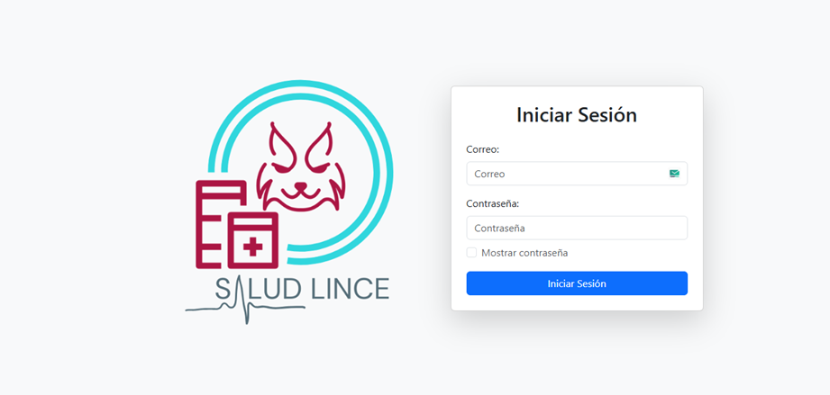
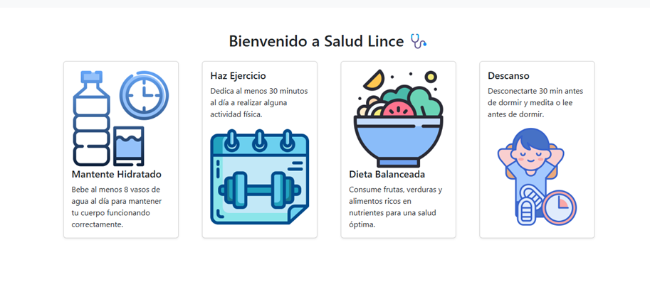
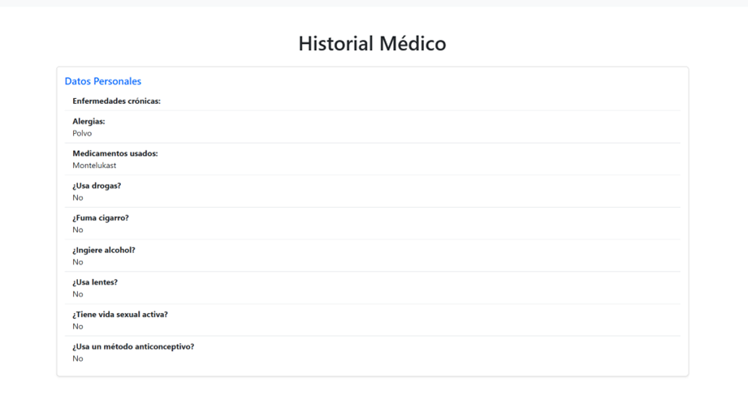
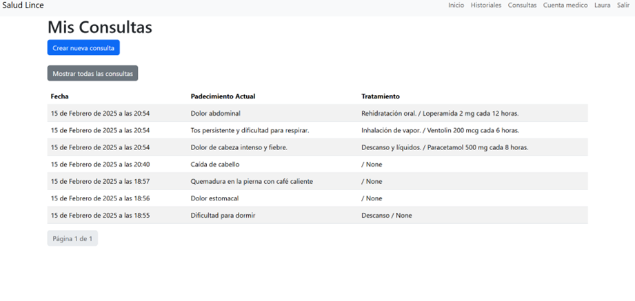

# Salud lince


## Descripción
Este proyecto tiene como objetivo crear un sistema medico web que facilite la realización de consultas médicas

### Librerías
- asgiref==3.8.1
- Django==4.2.7
- django-admin-extra-buttons==1.6.0
- django-environ==0.11.2
- django-ratelimit==4.1.0
- numpy==2.1.3
- packaging==24.2
- pandas==2.2.3
- plotly==5.24.1
- python-dateutil==2.9.0.post0
- pytz==2024.2
- six==1.16.0
- sqlparse==0.5.1
- tenacity==9.0.0
- tzdata==2024.2

## Instalación
1. Clona este repositorio en tu máquina local:
```bash
git clone https://github.com/brianrscode/sistema_medico.git
```

2. Crea un entorno virtual
```bash
python -m venv venv
```

3. Activa el entorno virtual
    - En Windows:

    ```bash
    venv\Scripts\activate
    ```

    - En macOS y Linux:

    ```bash
    source venv/bin/activate
    ```

4. Instala las librerías a través de `pip`:
```bash
pip install -r requirements.txt
```

5. Agrega tú archivo .env que contenga las variables de entorno de tu proyecto
```bash
SECRET_KEY=
DEBUG=True
NAME_BD=nombre_bd
USER_BD=usuario
PASSWORD_BD=contraseña
HOST_BD=localhost
PORT_BD=3306
LANGUAGE_CODE=
TIME_ZONE=
```

6. Activa Apache y MySQL en XAMPP

7. Crea la base de datos en XAMPP

8. Realiza las migraciones
```bash
python manage.py migrate
```

9. Ejecuta el proyecto
```bash
python manage.py runserver
```

## Vistas del sistema
<table>
    <tr>
        <td>
            
        </td>
        <td>
            
        </td>
    </tr>
    <tr>
        <td>
            
        </td>
        <td>
            
        </td>
    </tr>
</table>