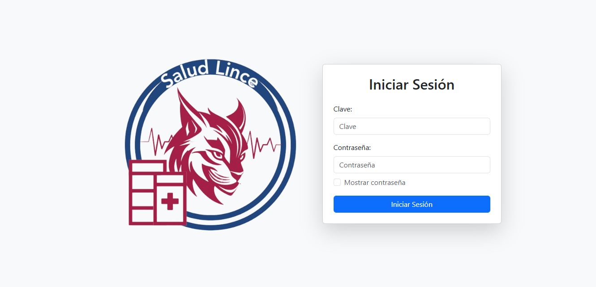
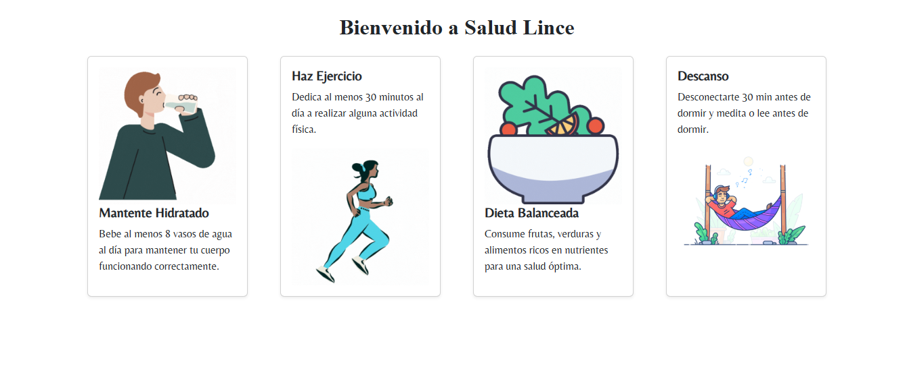
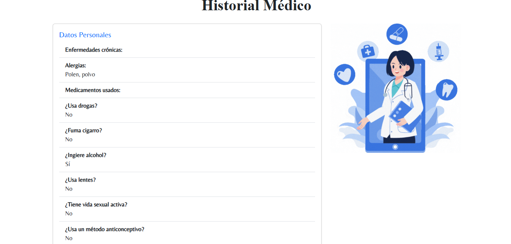

<h1>Salud lince</h1>
<!-- align="center" -->


Aplicación web para la gestión de consultas médicas en un entorno académico.


<!--  -->


## 📝 Descripción

**Salud Lince** es una aplicación médica desarrollada para mejorar la atención clínica dentro de una institución educativa, permitiendo el registro, consulta y gestión de historiales médicos.


## ⚙️ Instalación
Sigue estos pasos para instalar el proyecto en tu entorno local:

1. Clona este repositorio en tu máquina local:
```bash
git clone https://github.com/brianrscode/salud_lince.git
cd salud_lince
```

2. Crea un entorno virtual
```bash
python -m venv venv
```

3. Activa el entorno virtual
    - En Windows:

    ```bash
    venv\Scripts\activate
    ```

    - En macOS y Linux:

    ```bash
    source venv/bin/activate
    ```

4. Instala las dependencias:
```bash
pip install -r requirements.txt
```

5. Agrega tú archivo .env que contenga las variables de entorno de tu proyecto:
```bash
SECRET_KEY=tu_clave
DEBUG=True
NAME_BD=nombre_bd
USER_BD=usuario_bd
PASSWORD_BD=contraseña
HOST_BD=localhost
PORT_BD=5432
TIME_ZONE=America/Mexico_City
```

6. Inicia tu gestor de base de datos y crea la base.

7. Aplica las migraciones:
```bash
python manage.py makemigrations
```
```bash
python manage.py migrate
```

8. Ejecuta el servidor:
```bash
python manage.py runserver
```

## 👥 Uso
Puedes crear un superusuario con:
```bash
python manage.py createsuperuser
```

Ingresa a:
```bash
http://127.0.0.1:8000/
```


## Vistas de la aplicación
<table align="center">
    <tr>
        <td>
            
            <p align="center">Pantalla de inicio de sesión</p>
        </td>
        <td>
            
            <p align="center">Dashboard del paciente</p>
        </td>
    </tr>
    <tr>
        <td>
            
                <p align="center">Historial clínico</p>
        </td>
        <td>
            
            <p align="center">Gestión de consultas</p>
        </td>
    </tr>
</table>
